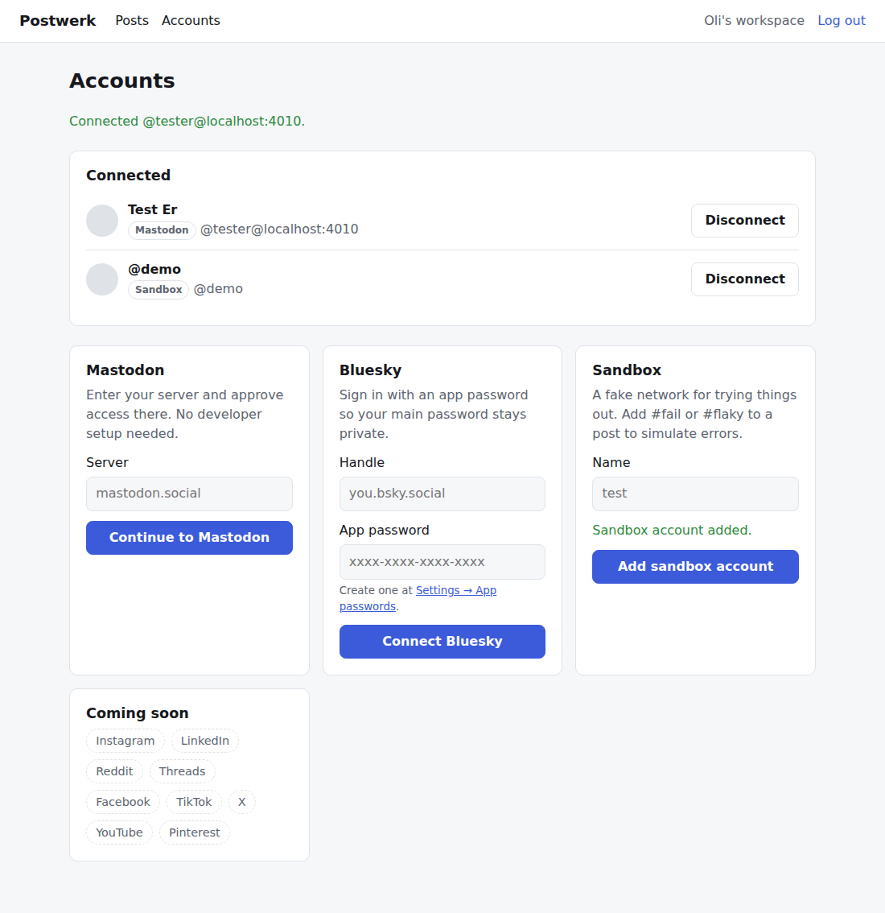
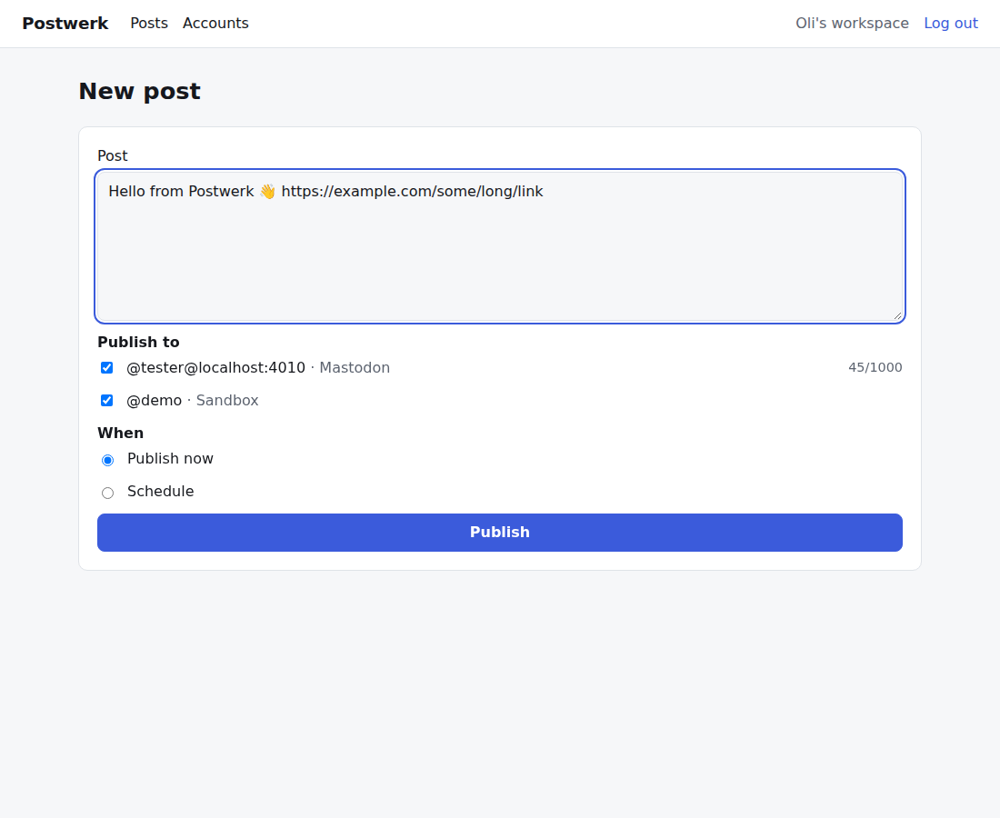
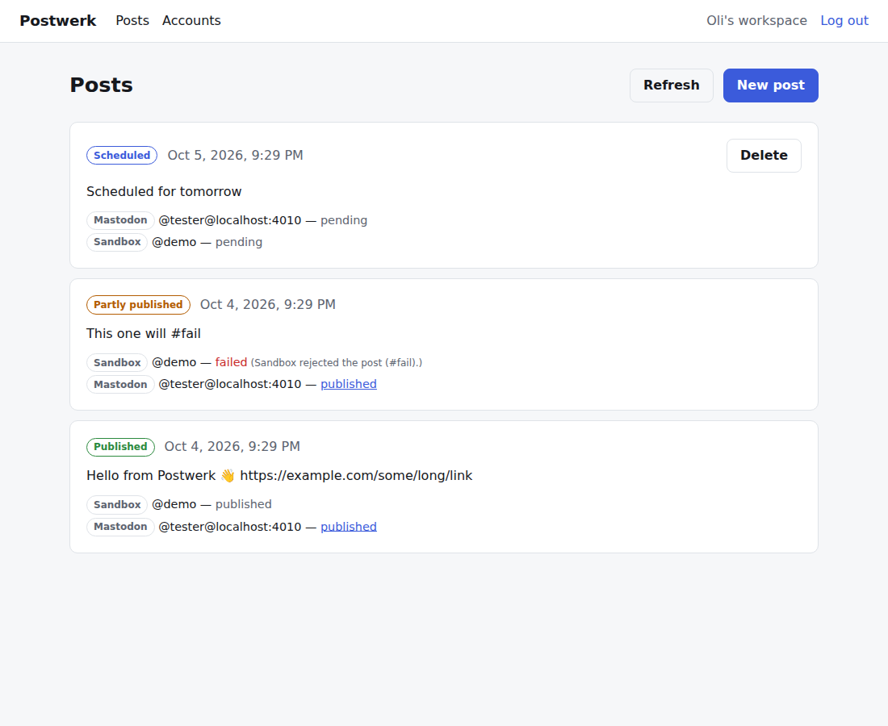

# Postwerk

Self-hosted social media scheduling. Connect your accounts with one click, write a post once, publish it everywhere — now or later.

- **No developer setup for users.** Mastodon and Bluesky work out of the box; Instagram, LinkedIn, Reddit & more are on the [roadmap](docs/PLAN.md) via a bridge first, then native integrations.
- **Reliable publishing.** Every network is published and retried independently, with backoff, crash recovery and clear "reconnect needed" states.
- **Your data stays yours.** Tokens are encrypted at rest; runs anywhere Docker runs.

| Accounts | Composer | Posts |
|---|---|---|
|  |  |  |

## Status

Phase 0 (foundation) is done: accounts, workspaces, Mastodon, Bluesky, a sandbox network, scheduling and the publishing worker. See [docs/PLAN.md](docs/PLAN.md) for what comes next and [docs/PLATFORMS.md](docs/PLATFORMS.md) for per-network requirements.

## Quick start (development)

Requirements: Node 22+, Docker.

```bash
npm install
cp .env.example .env
sed -i "s|^ENCRYPTION_KEY=.*|ENCRYPTION_KEY=$(openssl rand -base64 32)|" .env
npm run services:up        # Postgres on localhost:5432
docker compose exec postgres psql -U postwerk -c "CREATE DATABASE postwerk_test"   # for tests
npm run db:migrate
npm run dev                # web on http://localhost:3000 + worker
```

Sign up, add a **Sandbox** account and schedule a post. Put `#fail` or `#flaky` in the text to see error handling.

## Self-hosting

```bash
cp .env.example .env       # set ENCRYPTION_KEY, APP_URL, POSTGRES_PASSWORD
docker compose --profile app up -d --build
```

This starts Postgres, runs migrations, and launches the web app (port 3000) and the worker. Put a reverse proxy with HTTPS in front of the web app and set `APP_URL` to the public URL — OAuth callbacks depend on it.

| Variable | Required | Description |
|---|---|---|
| `DATABASE_URL` | yes | Postgres connection string |
| `ENCRYPTION_KEY` | yes | 32 random bytes, base64 (`openssl rand -base64 32`). Encrypts account tokens; do not change after accounts are connected |
| `APP_URL` | yes | Public URL without trailing slash |
| `ENABLE_SANDBOX` | no | `true` shows the fake Sandbox network |
| `WORKER_POLL_INTERVAL_MS` | no | How often the worker checks for due posts (default 10000) |

## Project structure

```
apps/web             Next.js app: UI, server actions, OAuth callbacks
apps/worker          Publishing worker (polls Postgres for due posts)
packages/core        Posts, accounts, publishing loop, encryption, auth helpers
packages/db          Drizzle schema + SQL migrations
packages/providers   Network integrations behind one Provider interface
docs/                Plan, platform guide, screenshots
```

## Scripts

| Command | What it does |
|---|---|
| `npm run dev` | Web app + worker with hot reload |
| `npm test` | Unit tests; integration tests run when `TEST_DATABASE_URL` is set |
| `npm run typecheck` | TypeScript across all packages |
| `npm run build` | Production builds of web and worker |
| `npm run db:generate` | Create a migration after changing `packages/db/src/schema.ts` |
| `npm run db:migrate` | Apply migrations |
