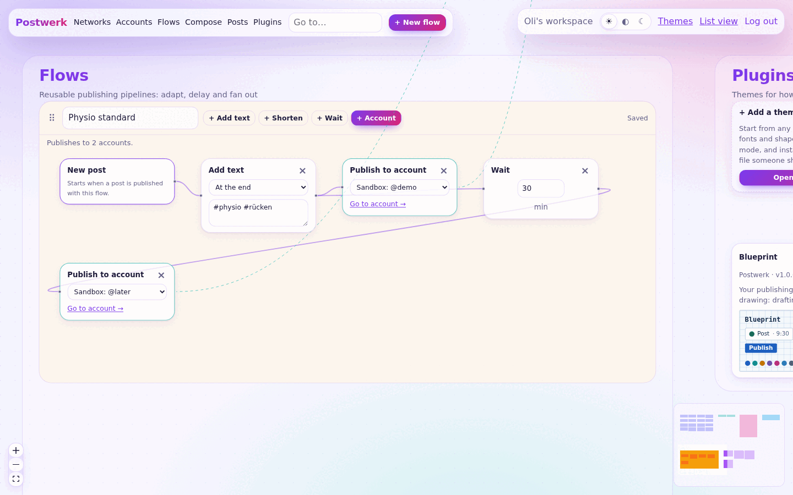
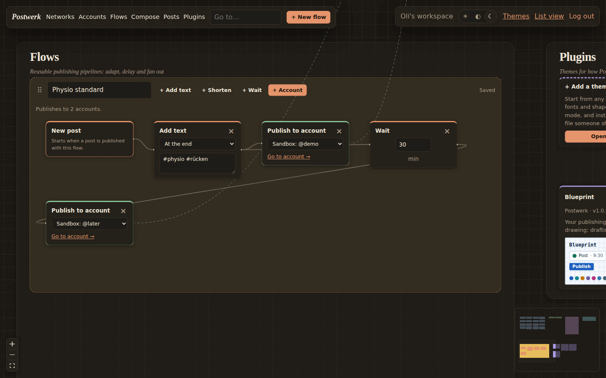
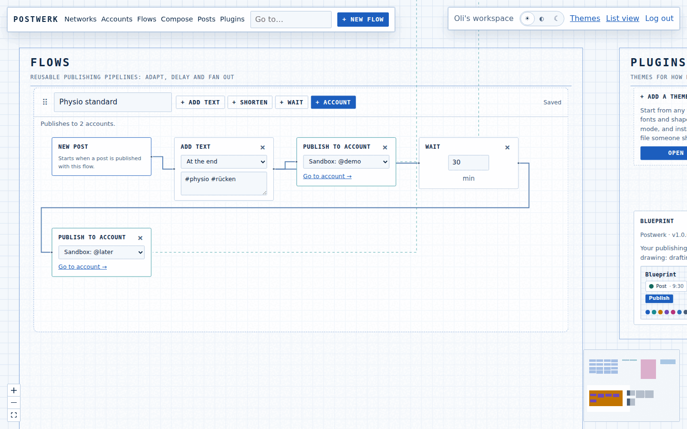
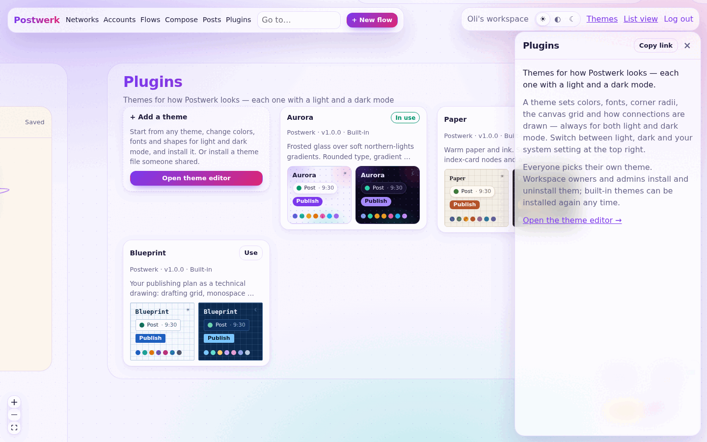

# Themes

Postwerk's whole look is a plugin. A **theme** sets the colors, fonts, corner radii, the canvas grid and how connections are drawn — always for **both light and dark mode** — and can add its own CSS on top.

Three themes ship with Postwerk and are installed in every new workspace:

| | Light | Dark |
|---|---|---|
| **Aurora** (default) — frosted glass over soft northern-lights gradients, rounded type, gradient buttons |  |  |
| **Paper** — warm paper and ink, serif headings, index-card nodes, a ruled canvas |  |  |
| **Blueprint** — a technical drawing: drafting grid, monospace labels, square corners, right-angled connections |  |  |

## Using themes

Themes live in the **Plugins** region of the canvas (`/canvas#n=region:plugins`).



- **Everyone picks their own theme**: select a theme card and choose *Use*. With nothing chosen (or after your theme is uninstalled) you get the workspace's first installed theme.
- **Light, dark or system** is the switch at the top right. It is remembered per browser, so your phone and laptop can differ. Every theme supports both modes.
- **Workspace owners and admins install and uninstall** themes. Built-in themes can be uninstalled and installed again at any time; they update together with Postwerk. With every theme uninstalled, Postwerk falls back to its plain base look (still light and dark).
- **Make your own** with the theme editor (the *Add a theme* card): start from any theme, change what you like, and choose *Install and use*. Installing a theme with the same `id` again updates it, so you can keep tweaking. *Download* gives you the theme file to share; others install it from the same editor.

## The theme file

A theme is a JSON file:

```json
{
  "kind": "theme",
  "id": "mint",
  "name": "Mint",
  "version": "1.0.0",
  "author": "You",
  "description": "Fresh and calm.",
  "base": {
    "font": "\"Avenir Next\", system-ui, sans-serif",
    "radius": "10px",
    "radius-card": "14px"
  },
  "light": {
    "bg": "#f2f7f5", "surface": "#ffffff", "text": "#15302a", "muted": "#5b7770", "border": "#d3e4de",
    "accent": "#1f8a6d", "accent-text": "#ffffff", "success": "#2b8a3e", "warn": "#b35c00", "error": "#c92a2a",
    "tint-network": "#3b82f6", "tint-account": "#14b8a6", "tint-flow": "#eab308", "tint-step": "#f97316",
    "tint-composer": "#d946ef", "tint-posts": "#0ea5e9", "tint-plugin": "#8b5cf6",
    "glow": "rgb(31 138 109 / 0.15)"
  },
  "dark": {
    "bg": "#0f1a17", "surface": "#16241f", "text": "#e3f1ec", "muted": "#8fb0a6", "border": "#25403a",
    "accent": "#5fd3b0", "accent-text": "#06221a", "success": "#69db7c", "warn": "#ffa94d", "error": "#ff8787",
    "tint-network": "#7aa7ff", "tint-account": "#5eead4", "tint-flow": "#fde047", "tint-step": "#fdba74",
    "tint-composer": "#f0abfc", "tint-posts": "#7dd3fc", "tint-plugin": "#c4b5fd",
    "glow": "rgb(95 211 176 / 0.2)"
  },
  "canvas": { "pattern": "dots", "gap": 24, "size": 1.4, "edges": "smoothstep" },
  "css": ".is-selected { box-shadow: 0 0 0 6px var(--glow); }"
}
```

| Field | |
|---|---|
| `kind` | Always `"theme"`. |
| `id` | Lowercase letters, digits and dashes. Identifies the theme in a workspace; installing the same id again updates it. The built-in ids (`aurora`, `paper`, `blueprint`) are reserved. |
| `name`, `version`, `author`, `description` | Shown on the theme card. Only `name` is required. |
| `base` | Tokens shared by both modes — usually fonts and radii. |
| `light`, `dark` | Tokens per mode. Whatever one mode sets, the other must set too (or move it to `base`). |
| `canvas` | Grid and connections, see below. Optional. |
| `css` | Extra CSS while the theme is active. Optional. |

### Tokens

Tokens are CSS variables (written without the leading `--`). Every theme must set these colors for both modes:

| Token | Used for |
|---|---|
| `bg` | Page and canvas background |
| `surface` | Cards, panels, toolbars, inspector |
| `text`, `muted` | Text, secondary text |
| `border` | Borders and dividers |
| `accent`, `accent-text` | Buttons, links, selection — and the text on them |
| `success`, `warn`, `error` | Status colors |
| `tint-network`, `tint-account`, `tint-flow`, `tint-step`, `tint-composer`, `tint-posts`, `tint-plugin` | Each region's color: borders, node accents, minimap |

These are optional; Postwerk derives sensible defaults:

| Token | Default | Used for |
|---|---|---|
| `canvas` | `transparent` | Canvas color on top of `bg` |
| `backdrop` | `none` | Background images behind everything, e.g. gradients (Aurora) |
| `grid` | `muted` at 45% | Canvas dots or lines |
| `edge` | `muted` at 60% | Connections |
| `field` | `bg` | Inputs |
| `region-bg` | `surface` at 35% | Region fill |
| `shadow`, `shadow-lg` | soft shadows | Cards; panels and toolbars |
| `font`, `font-heading`, `font-mono` | system fonts | Body text, headings, code |
| `radius`, `radius-card`, `radius-region` | `8px`, `12px`, `28px` | Corners of controls, cards, regions |

Any other name (like `glow` above) is your own token: set it in both modes and use it in your CSS as `var(--glow)`.

### Canvas

| Key | Values | Default |
|---|---|---|
| `pattern` | `dots`, `lines`, `cross`, `none` | `dots` |
| `gap` | Grid spacing in px, 4–200 | `24` |
| `size` | Dot size or line width in px, 0.2–10 | `1.2` |
| `edges` | `smoothstep` (rounded), `bezier` (curved), `step` (right angles), `straight` | `smoothstep` |

### Extra CSS

Your CSS loads after Postwerk's own styles, so the same selectors win. Useful hooks:

- Canvas: `.world-root`, `.region` and `.region-networks` … `.region-plugins` (with `header`, `h2`, `p`), `.world-card` (`.network-node`, `.account-node`, `.step-node` with `.step-trigger`, `.step-addText`, `.step-shorten`, `.step-delay`, `.step-target`, `.plugin-node`), `.flow-frame`, `.flow-header`, `.world-panel`, `.world-toolbar`, `.world-account`, `.inspector`, `.is-selected`, edges `.flow-edge`, `.link-edge`, `.feed-edge`.
- Everywhere: `.brand`, `.topbar`, `.card`, `button` (`.secondary`, `.link`, `.small`), `.badge`, `.chip`, inputs.

Light and dark switch by swapping tokens, so CSS cannot target a mode directly. Put anything that differs between modes into a token (set in both `light` and `dark`) and use `var(--…)`.

### Rules

Themes are self-contained, so installing one can never track people or leak data:

- No files from other sites: `url()` only with `data:` URLs, no `@import`. Use fonts that are installed on the device (list fallbacks) or embed them as `data:` URLs.
- No `<` and no backslash escapes in CSS — type the character itself (`content: "→"`).
- A token is a single CSS value: no `;`, braces, `@` or comments.
- Up to 300 KB per theme file and 200 KB of CSS.

The theme editor checks all of this as you type and shows a live preview of both modes.

## For developers

- Format, validation and the stylesheet generator: `packages/core/src/theme.ts` (`@postwerk/core/theme`, browser-safe). The built-in themes are in `packages/core/src/themes/` — they use the same format.
- Installed plugins per workspace: `plugins` table; a member's choice: `workspace_members.theme`; functions in `packages/core/src/plugins.ts`.
- The root layout (`apps/web/app/layout.tsx`) renders `<html data-theme data-mode>` and the active theme's `<style>`; the base tokens and their defaults are at the top of `apps/web/app/globals.css`.
- To ship another built-in theme, add a file to `packages/core/src/themes/` and list it in `builtinThemes`. New workspaces get it installed; existing ones see it on the canvas with an *Install* button.
