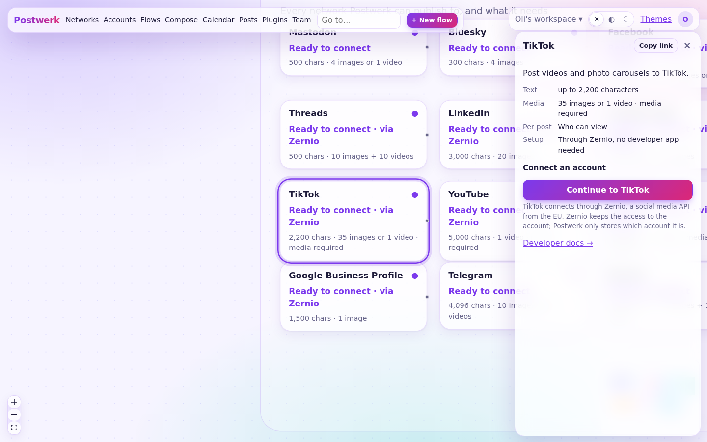
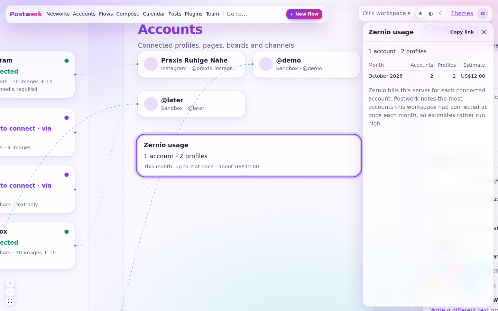

# The Zernio bridge

Most networks only accept posts from a developer app they know. The bridge is one of the [three ways to offer a network](networks/index.md): instead of registering your own app, the **bridge** connects the network through an aggregator API that already passed every review. People click "Continue to Instagram", sign in on the aggregator's pages, and the account appears in Postwerk. Posts go out through the aggregator.

Postwerk uses [Zernio](https://zernio.com) (formerly Late) for this. The bridge is an interface (`Bridge` in `packages/providers/src/bridge.ts`), so another aggregator can be added later.

| Connecting through Zernio | What it costs |
|---|---|
|  |  |

## Why Zernio

Compared in October 2026 on price, EU data handling and API quality. Prices change, so check them before you sign up.

| | Zernio | Upload-Post |
|---|---|---|
| Company | Girona, Spain | Málaga, Spain (TONVI TECH S.L.) |
| Data processing agreement (GDPR) | yes | yes, applies to every business customer automatically |
| Billed by | connected account; profiles are free | plan: number of profiles (and uploads on the free plan) |
| Small setup | first 2 accounts free, then per account and month: $6 (accounts 3–10), $3 (11–100), $1 (101–2,000) | free: 2 profiles, 10 uploads a month; Basic: 5 profiles, $16 a month billed yearly ($24 monthly) |
| Hosted account linking | a connect link per network and profile that returns to Postwerk with the account | a signed connect link per profile, valid 48 hours |

[Ayrshare](https://www.ayrshare.com) was ruled out on price: $149 a month for one profile, $599 for 30.

Zernio fits a self-hosted server best. A small team pays only for the accounts it uses, nothing for idle profiles. It is an EU company with a DPA, and it covers all ten networks that need a developer app. Its API (read from the official `@zernio/node` SDK) makes two key decisions reliable: an `Idempotency-Key` header means a retry never posts twice, and each network's result comes back with an error category (usually right away; videos once processed), so Postwerk can tell "retry" from "reconnect". Where Zernio stores data is not stated publicly; check its DPA if that matters to you.

## Setting it up

1. Create an account at [zernio.com](https://zernio.com) and an API key in its dashboard.
2. Set `ZERNIO_API_KEY` and restart web and worker.
3. Every network that has no developer app on this server now shows "Ready to connect · via Zernio".

Optional settings:

| Variable | What it does |
|---|---|
| `ZERNIO_NETWORKS` | Comma-separated network ids that use Zernio, e.g. `instagram,tiktok`. Listed networks go through Zernio even when a developer app is set up; other networks never do. Leave empty to use Zernio for every network without a developer app |
| `ZERNIO_ACCOUNT_PRICE` | Your monthly price per account, e.g. `6` (USD) or `5.50 EUR`. Admins then see cost estimates |
| `ZERNIO_BASE_URL` | API address (default `https://zernio.com/api`); point it at a fake server for tests |

## How it works

**Routing.** For each network, Postwerk picks the first that works: its own developer app ("native") → the bridge → "needs setup"; `HIDE_NETWORKS` switches networks off. Mastodon, Bluesky, Telegram and Discord never need the bridge. `networkRoute()` in `packages/core/src/bridge.ts` decides.

**Connecting.** Zernio groups accounts in profiles; a profile holds one account per network. Postwerk creates profiles per workspace as needed ("Praxis · Postwerk", "Praxis · Postwerk 2", …), so a workspace can connect several accounts of one network. "Continue to …" creates a sign-in state and sends the browser to Zernio's hosted pages. Zernio sends it back to `/api/bridge/callback`. Postwerk then:

- checks the state (single use, same user, 10 minutes),
- looks the account up in the profile the sign-in started with (so a changed link cannot attach someone else's account),
- and saves it.

Zernio keeps the network tokens. Postwerk stores only Zernio's account and profile ids, encrypted like any credentials. The API key is read from the environment and never stored.

**Publishing.** The worker sends each target with its id as `Idempotency-Key`, so a retry never posts twice. Uploaded files go straight from Postwerk's storage to Zernio (a presigned upload), so the server needs no public address. Media links must be public `https` addresses. Videos are processed after upload, and the worker waits for the result. Zernio's error categories decide what happens next:

- an expired login means "reconnect needed",
- rate limits and network outages are retried,
- a rejected post fails with Zernio's message.

A rejected API key is reported as a server problem, not as a reconnect.

**Disconnecting** removes the account on Zernio too, so it stops counting toward the bill. **Reconnecting** an account whose access ran out keeps the same account, flows and history.

**Costs.** Postwerk notes each workspace's bridged accounts and profiles per month (`bridge_usage`), keeping the most connected at once. The numbers update on connect and disconnect and hourly from the worker. Admins see them on a card in the canvas's Accounts region and on the accounts page, with an estimate when `ZERNIO_ACCOUNT_PRICE` is set. The estimate multiplies the workspace's peak by your price. Zernio's free accounts and volume tiers apply to the whole server, so your actual bill may be lower.

## Privacy

Posts, media and the connected accounts' tokens pass through Zernio. Accept its data processing agreement. Postwerk's [built-in privacy page](legal.md) names Zernio as a processor, with the networks it connects, as soon as `ZERNIO_API_KEY` is set; if you use your own privacy policy, add it there.

## Moving a network to its own developer app

Once a network's own developer app is approved, set its `<PREFIX>_CLIENT_ID`/`_SECRET` (and remove it from `ZERNIO_NETWORKS`). New connections then go through the network directly. Accounts already connected through Zernio keep publishing through it. To move one, connect it again directly and disconnect the bridged one; then point flows at the new account.

## Known gaps

- Built from Zernio's official SDK (its OpenAPI types) and tested against a fake Zernio server, not yet with a live Zernio account.
- Postwerk's own limits per network still apply (e.g. Instagram only takes JPEG images), even where Zernio would convert.
- Zernio features beyond publishing (analytics, inbox, first comments) are not used.

## Adding another aggregator

Implement `Bridge` in `packages/providers/src/bridges/<name>.ts` (map its errors to `ProviderError` with `retryable`/`needsReauth`), add the id to `BRIDGE_IDS` and `bridges`, and test it like `test/zernio.test.ts`. `bridgeSetup()` in `packages/core/src/bridge.ts` currently reads Zernio's variables only; make it pick the configured bridge when there are two.
