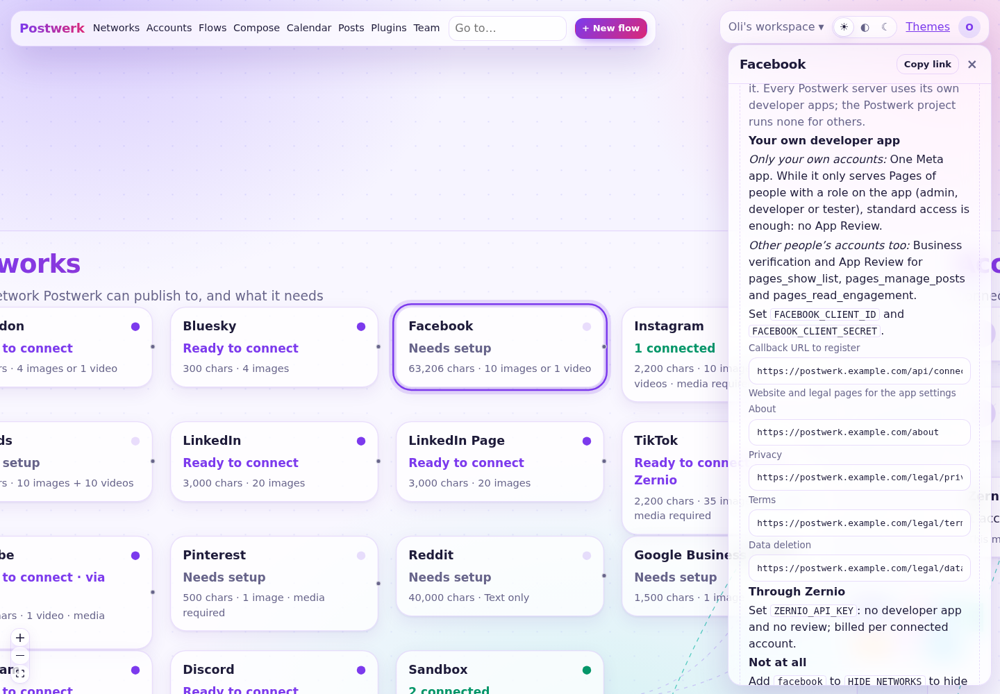

# Choose how to offer each network

Mastodon, Bluesky, Telegram and Discord work on every Postwerk server right away. The other networks only accept posts from a **developer app** they know. Whoever runs a Postwerk server decides, per network, how to provide one.

::: info Every server brings its own apps
A developer app belongs to one server: it is registered with that server's address, and its secret must stay on that server. That is why **the Postwerk project does not register apps or apply for reviews on behalf of the people who use it**. Each operator does that for their own server, as far as they need it. The author does the same for the server he runs for his own work.
:::

## Three ways per network

1. **Your own developer app.** You register an app with the network and put its id and secret into Postwerk's settings.
   - *Only your own accounts:* many networks let an app serve the accounts of the people who manage it without a review. For one person or a small team, this is often all you need.
   - *Other people's accounts too:* as soon as people outside your team should connect their accounts, most networks review the app first.
2. **The Zernio bridge.** Set `ZERNIO_API_KEY` and every network without its own app connects through [Zernio](../bridge.md), which has passed the reviews already. No developer app, no review; Zernio bills per connected account.
3. **Not at all.** Add the network to `HIDE_NETWORKS` (e.g. `HIDE_NETWORKS=x,tiktok`) and it disappears from the server. Accounts already connected stay.

You can mix them: for example LinkedIn and Meta with your own apps, TikTok and YouTube through Zernio, X off.

## What each network needs

| Network | Only your own accounts | Other people's accounts too | Guide |
|---|---|---|---|
| Mastodon, Bluesky, Telegram, Discord | nothing to set up | nothing to set up | [Open networks](open.md) |
| Facebook Pages | Meta app, standard access: no review | business verification, App Review | [Meta](meta.md#facebook) |
| Instagram | Meta app, standard access with Instagram testers: no review | App Review, business verification | [Meta](meta.md#instagram) |
| Threads | Meta app with Threads testers: no review | App Review | [Meta](meta.md#threads) |
| LinkedIn profile | self-serve products, ready at once | nothing more | [LinkedIn](linkedin.md#profile) |
| LinkedIn Pages | Community Management API: review, registered company | the same | [LinkedIn](linkedin.md#company-pages) |
| X | no review, but the API is paid per use | nothing more | [X](x.md) |
| TikTok | not possible: posts stay private, and tools for your own accounts are not approved | audit plus a required posting screen | [TikTok](tiktok.md) |
| YouTube | uploads stay private until the API audit | audit plus OAuth verification | [Google](google.md#youtube) |
| Google Business Profile | access request (profile verified for 60+ days) | plus OAuth verification | [Google](google.md#business-profile) |
| Pinterest | trial access: publishes to the app owner's account | standard access (review with a demo video) | [Pinterest](pinterest.md) |
| Reddit | manual approval since November 2025 | the same | [Reddit](reddit.md) |

Every network that needs an app can also go through [Zernio](../bridge.md).

Postwerk shows the same overview on the canvas: click a network to see what it needs, the exact callback URL to register, and the addresses of your legal pages to paste into the developer console.



## How Postwerk picks the route

For each network, Postwerk uses the first that works:

```
own developer app  →  Zernio  →  "needs setup"
```

An own app counts once `<PREFIX>_CLIENT_ID` and `_SECRET` are set; Zernio once `ZERNIO_API_KEY` is set.

- `ZERNIO_NETWORKS=instagram,tiktok` sends exactly these networks through Zernio, even if an app exists; the others never use Zernio.
- `HIDE_NETWORKS=x` switches networks off.

All settings are listed in [Configuration](../configuration.md).

## Before you register any app

- **A public https address.** Set `APP_URL` to it. Networks send people back to `${APP_URL}/api/connect/<network>/callback`, and Instagram, Threads, TikTok and Pinterest download images and videos from Postwerk, so the server must be reachable from the internet (or use S3 storage with `S3_PUBLIC_URL`).
- **Your legal pages.** Set `OPERATOR_NAME` and `OPERATOR_EMAIL` (and `OPERATOR_ADDRESS` for an imprint). Postwerk then serves the website, privacy policy, terms and data deletion page the developer consoles ask for. See [About and legal pages](../legal.md).
- **The review kit**, if a review is coming: [App reviews](reviews.md).

## Suggested setup for one person or a small team

| Network | Suggestion |
|---|---|
| LinkedIn profile | own app (self-serve, minutes) |
| Facebook, Instagram, Threads | own Meta app with standard access for your own accounts, or Zernio |
| Google Business Profile | own app if Google approves your access request; Zernio meanwhile |
| YouTube, TikTok, LinkedIn Pages | Zernio |
| X | Zernio (X's API costs are passed on) or off |
| Pinterest, Reddit | Zernio, or your own app once approved |
